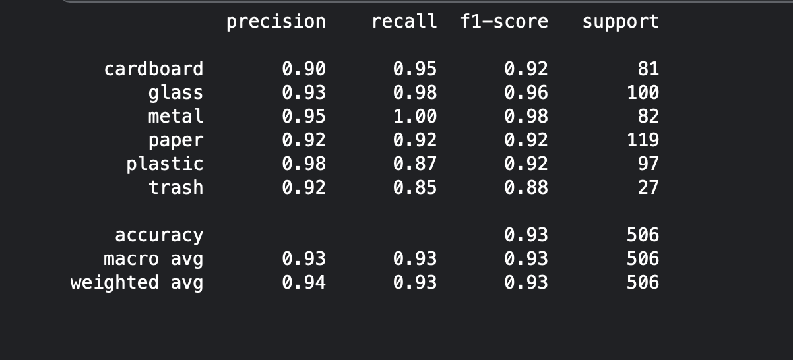
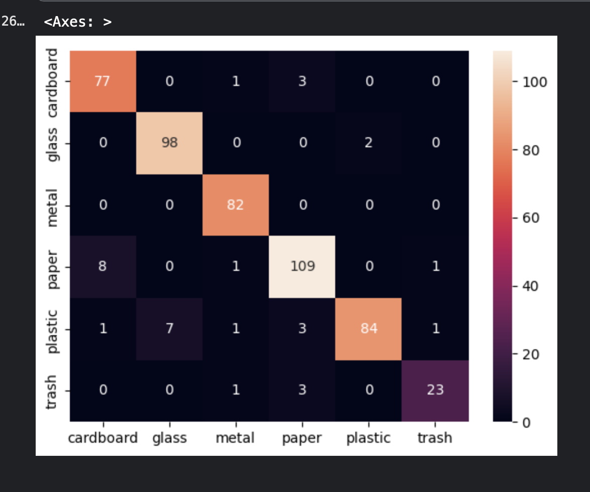
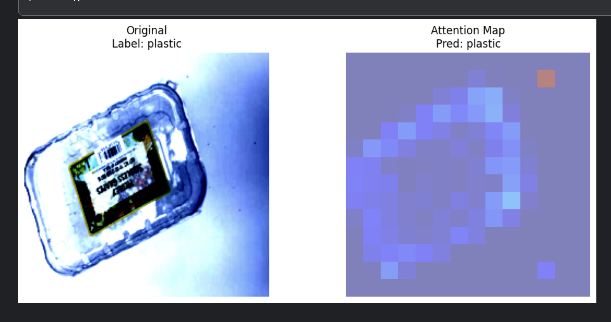
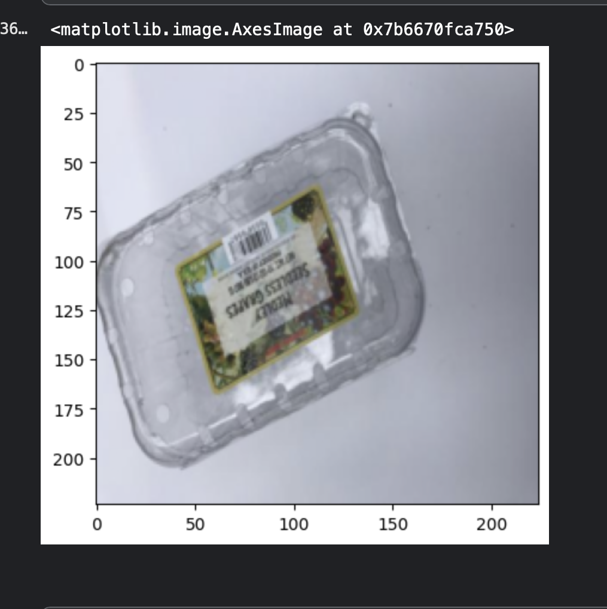

# Waste Classification using Vision Transformers (ViT)

## Overview
This project implements an AI-powered waste classification system using Vision Transformers (ViT) and transfer learning techniques.

The model classifies waste into six categories:

- Cardboard
- Glass
- Metal
- Paper
- Plastic
- Trash

The objective is to support automated waste segregation and sustainable waste management.

---

## Dataset

Dataset: TrashNet

- ~2500 images
- 6 waste categories
- Real-world waste samples

Preprocessing:
- Image resizing
- Normalization
- Data augmentation

---

## Model

- Vision Transformer (ViT)
- Transfer Learning
- Fine-tuning on TrashNet
- Explainable AI using attention visualization

---

## Results

| Metric | Score |
|----------|----------|
| Accuracy | 93% |
| Precision | 94% |
| Recall | 93% |
| F1 Score | 93% |

---

## Technologies Used

- Python
- PyTorch
- Transformers
- NumPy
- Pandas
- Matplotlib
- Scikit-learn

---

## Project Highlights

- Fine-tuned pretrained Vision Transformer
- Applied transfer learning techniques
- Implemented explainability using attention maps
- Achieved high classification performance

---

## Results

### Classification Report

### Confusion Matrix

### Attention Visualization

### Sample Predictions

## Kaggle Notebook

https://www.kaggle.com/code/apaarrao/waste-classification

## Installation

pip install -r requirements.txt

## Run

jupyter notebook waste-classification.ipynb

